# Prototipo Fintech

**Jose Miguel Chaves Miranda**

**Andres Aguilar Masis**

**Daniel Hernandez Sanchez**

## Mockups

\#\#\#\#\#\# \*Prototipos de pantallas\*

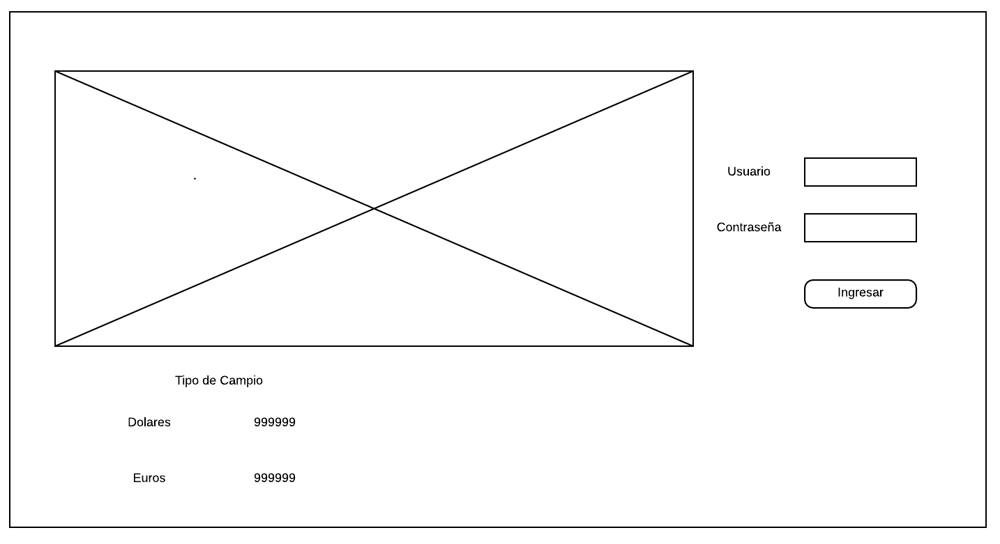

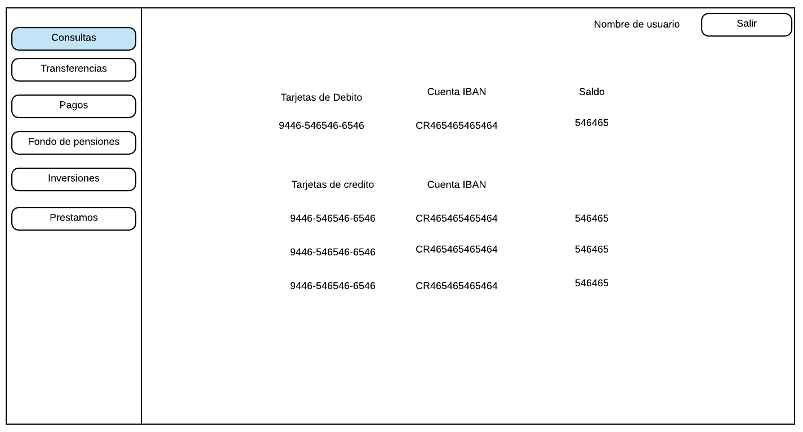

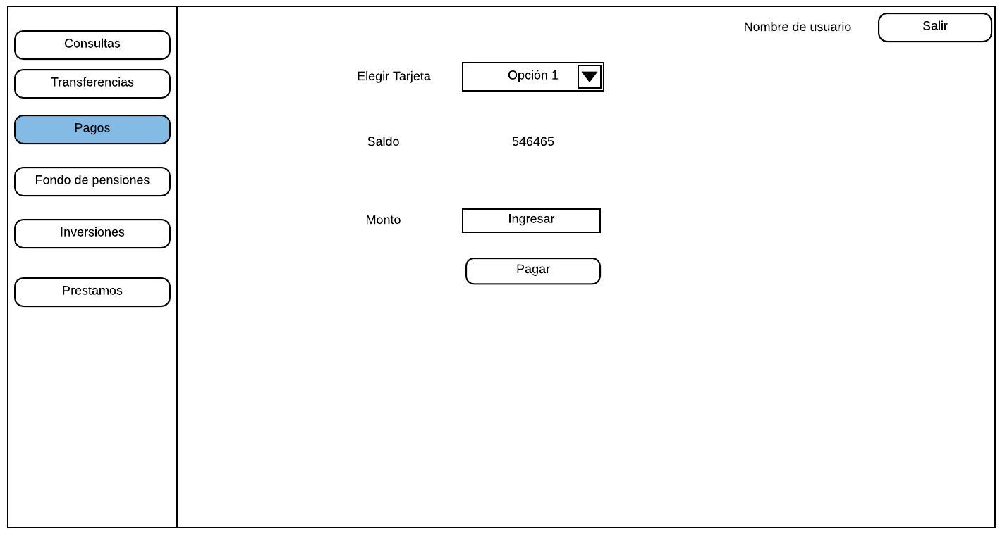

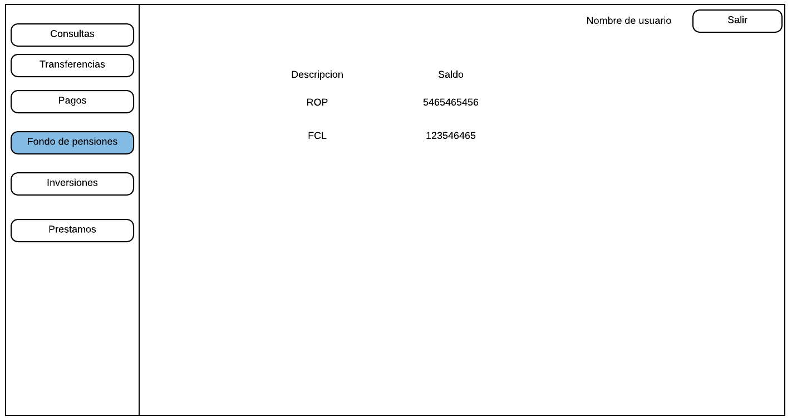

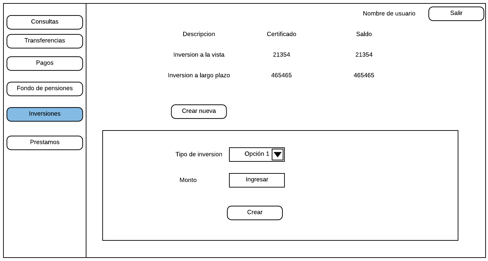

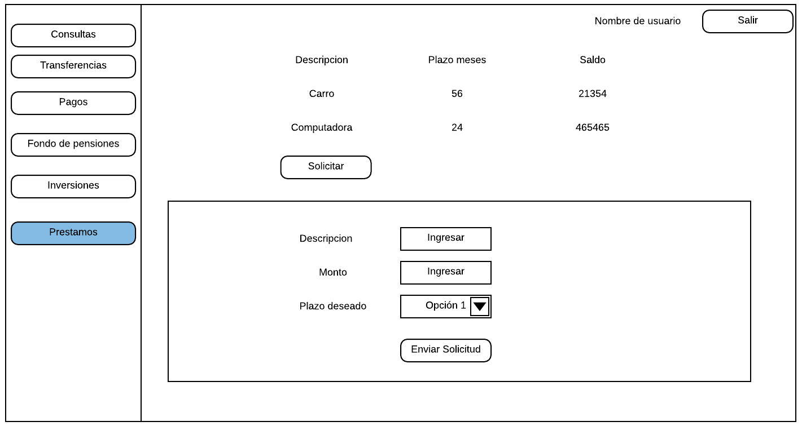

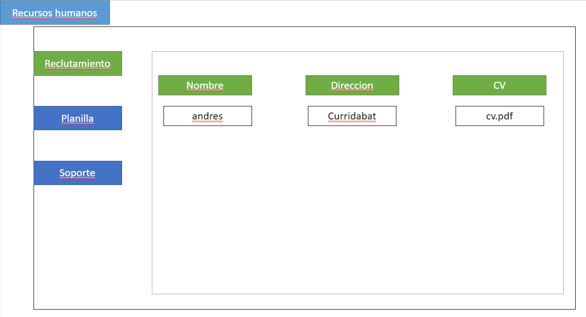

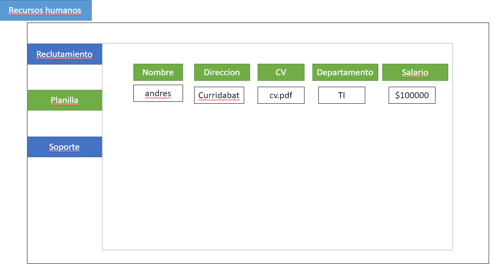

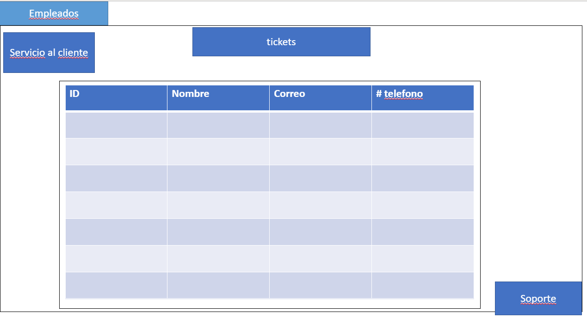

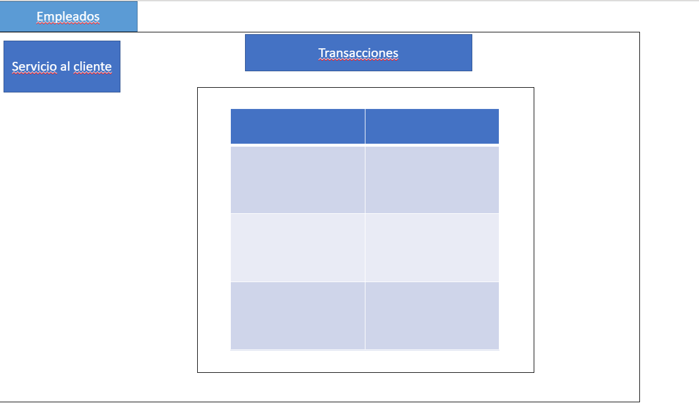

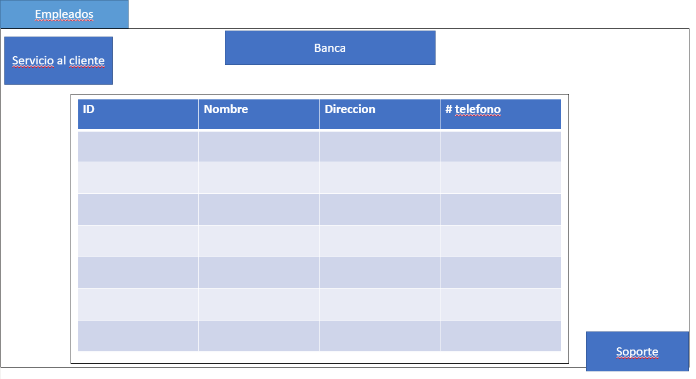

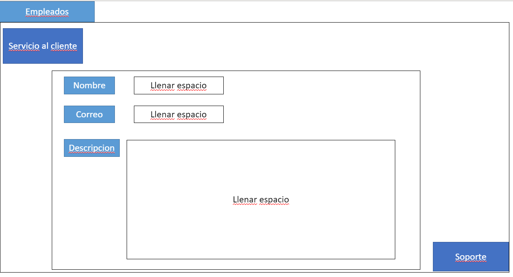

## CASO DE USO

\#\#\#\#\#\# \*En este caso de uso vemos a un nivel alto lo que sería nuestra
aplicación web con los debidos protocolos de autenticación y sus diferentes
secciones por usuario\*

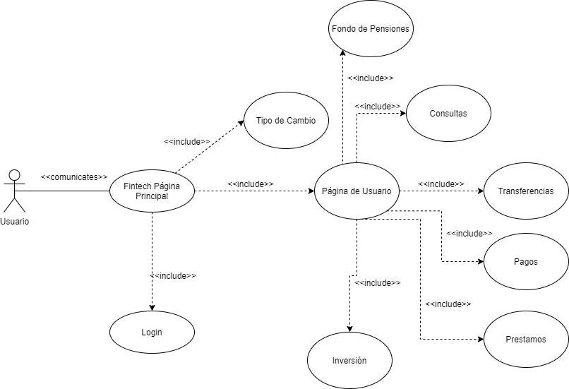

## RED

\#\#\#\#\#\# \*En este Diagrama de Red vemos como sería el sistema a un alto
nivel\*

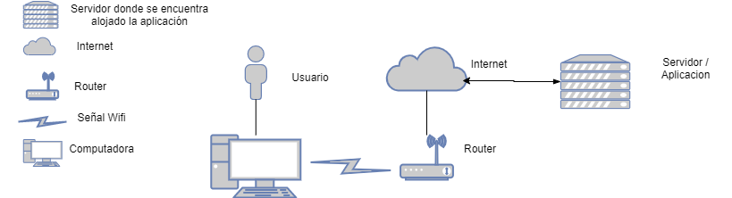

## Seguridad

\#\#\#\#\#\# \*En este diagrama vemos todos los protocolos de seguridad que se
utilizaron\*

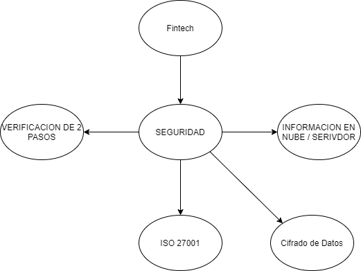

## Diagrama de Secuencia

\#\#\#\#\#\# \*Breve descripción de la secuencia de un usuario que ingresa a la
pagina para realizar una transferencia de una cuenta a otra.\*

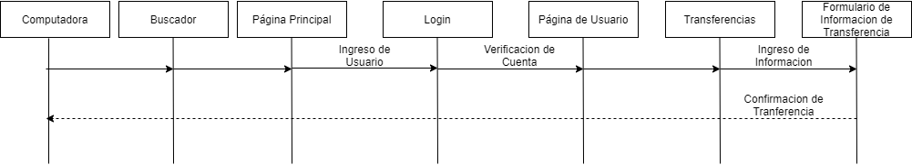

## Diagrama de Clases

\#\#\#\#\#\# \*Mapeo de las diferentes clases que existen en el proyecto con sus
variables y diferentes acciones que pueden realizar.\*

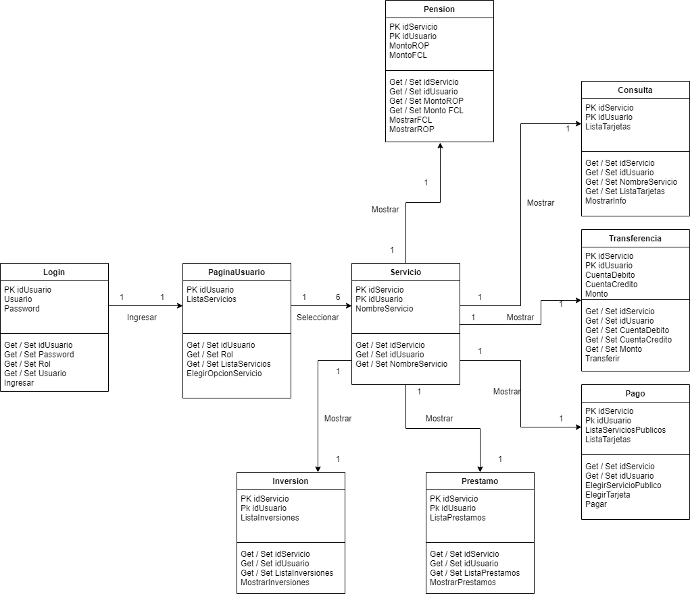

Imagen que contiene texto Descripción generada automáticamente

## Diagrama de Objetos

\#\#\#\#\#\# \*Mapeo de los diferentes Objetos con sus respectivos atributos.\*

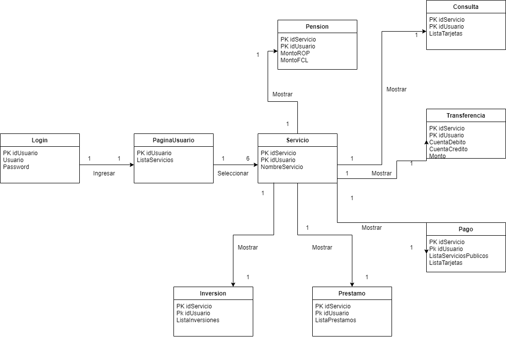

## NRAF

\#\#\#\#\#\# \*En la table NRAF Podemos ver el detalle de los diferentes
servicios que serán requeridos para la funcionalidad correcta de la aplicación
en diferentes niveles tanto como de bases de datos, servicios de terceros y la
conexión de parte de un cliente o administrador. Se especifica el tipo de
conexión, el puerto destinado para el servicio y el tipo de tráfico que este
tendrá.\*

| **Tipo de Servicio**             | **IP de Fuente** | **IP de Destino** | **Puerto** | **Tipo de Trafico** | **TCP / UDP** |
|----------------------------------|------------------|-------------------|------------|---------------------|---------------|
| Correo                           | 192.168.0.1      | 192.168.0.16      | 443        | Bidireccional       | TCP           |
| Correo                           | 192.168.0.16     | 192.168.0.1       | 443        | Bidireccional       | TCP           |
| Base de datos                    | 192.168.0.1      | 192.168.0.16      | 3306       | Bidireccional       | TCP           |
| Base de datos                    | 192.168.0.16     | 192.168.0.1       | 3306       | Bidireccional       | TCP           |
| Tipo de Cambio del Banco Central | 192.168.0.16     | 192.168.0.1       | 80         | Unidireccional      | UDP           |
| Transacciones                    | 192.168.0.1      | 192.168.0.16      | 2049       | Bidireccional       | TCP           |
| Transacciones                    | 192.168.0.16     | 192.168.0.1       | 2049       | Bidireccional       | TCP           |
| Validacion Cliente               | 192.168.0.1      | 192.168.0.16      | 1812       | Bidireccional       | TCP           |
| Validacion Cliente               | 192.168.0.16     | 192.168.0.1       | 1812       | Bidireccional       | TCP           |
| Cuentas de Cliente               | 192.168.0.16     | 192.168.0.1       | 80         | Unidireccional      | UDP           |
| Fondo de Pensiones               | 192.168.0.16     | 192.168.0.1       | 80         | Unidireccional      | UDP           |
| Consulta de Saldos               | 192.168.0.16     | 192.168.0.1       | 80         | Unidireccional      | UDP           |
| Pagos                            | 192.168.0.1      | 192.168.0.16      | 443        | unidireccional      | TCP           |
| vpn                              | 192.168.0.1      | 192.168.0.16      | 51871      | unidireccional      | UDP           |
| autenticacion                    | 192.168.0.16     | 192.168.0.1       | 1812       | Bidireccional       | TCP           |
| autenticacion                    | 192.168.0.1      | 192.168.0.16      | 1812       | Bidireccional       | TCP           |
| Movimiento de cuentas            | 192.168.0.16     | 192.168.0.1       | 443        | Bidireccional       | TCP           |
| Movimiento de cuentas            | 192.168.0.1      | 192.168.0.16      | 443        | Bidireccional       | TCP           |
| Estado de cuenta                 | 192.168.0.16     | 192.168.0.1       | 443        | Bidireccional       | TCP           |
| Estado de cuenta                 | 192.168.0.1      | 192.168.0.16      | 443        | Bidireccional       | TCP           |
| transferencias al exterior       | 192.168.0.1      | 192.168.0.16      | 443        | unidireccional      | TCP           |
| cheques                          | 192.168.0.1      | 192.168.0.16      | 443        | unidireccional      | TCP           |
| Servidor Host                    | 192.168.0.1      | 192.168.0.16      | 2082       | Bidireccional       | TCP           |
| Servidor Host                    | 192.168.0.16     | 192.168.0.1       | 2082       | Bidireccional       | TCP           |
