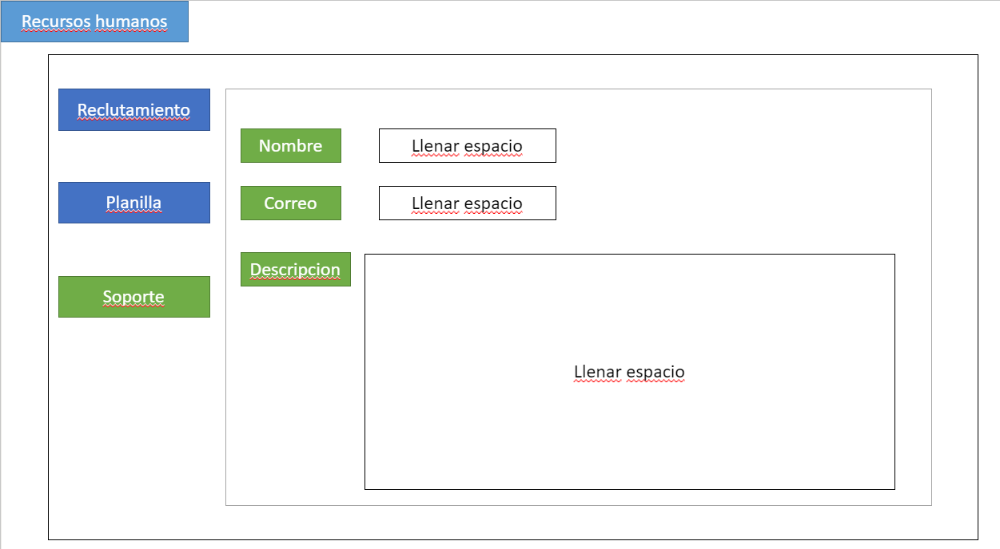

# Prototipo Fintech

**Jose Miguel Chaves Miranda**

**Andres Aguilar Masis**

**Daniel Hernandez Sanchez**

## Mockups

## CASO DE USO

## RED

## Seguridad

## Diagrama de Secuencia

## Diagrama de Clases

## Diagrama de Objetos

## NRAF

| **Tipo de Servicio**             | **IP de Fuente** | **IP de Destino** | **Puerto** | **Tipo de Trafico** | **TCP / UDP** |
|----------------------------------|------------------|-------------------|------------|---------------------|---------------|
| Correo                           | 192.168.0.1      | 192.168.0.16      | 443        | Bidireccional       | TCP           |
| Correo                           | 192.168.0.16     | 192.168.0.1       | 443        | Bidireccional       | TCP           |
| Base de datos                    | 192.168.0.1      | 192.168.0.16      | 3306       | Bidireccional       | TCP           |
| Base de datos                    | 192.168.0.16     | 192.168.0.1       | 3306       | Bidireccional       | TCP           |
| Tipo de Cambio del Banco Central | 192.168.0.16     | 192.168.0.1       | 80         | Unidireccional      | UDP           |
| Transacciones                    | 192.168.0.1      | 192.168.0.16      | 2049       | Bidireccional       | TCP           |
| Transacciones                    | 192.168.0.16     | 192.168.0.1       | 2049       | Bidireccional       | TCP           |
| Validacion Cliente               | 192.168.0.1      | 192.168.0.16      | 1812       | Bidireccional       | TCP           |
| Validacion Cliente               | 192.168.0.16     | 192.168.0.1       | 1812       | Bidireccional       | TCP           |
| Cuentas de Cliente               | 192.168.0.16     | 192.168.0.1       | 80         | Unidireccional      | UDP           |
| Fondo de Pensiones               | 192.168.0.16     | 192.168.0.1       | 80         | Unidireccional      | UDP           |
| Consulta de Saldos               | 192.168.0.16     | 192.168.0.1       | 80         | Unidireccional      | UDP           |
| Pagos                            | 192.168.0.1      | 192.168.0.16      | 443        | unidireccional      | TCP           |
| vpn                              | 192.168.0.1      | 192.168.0.16      | 51871      | unidireccional      | UDP           |
| autenticacion                    | 192.168.0.16     | 192.168.0.1       | 1812       | Bidireccional       | TCP           |
| autenticacion                    | 192.168.0.1      | 192.168.0.16      | 1812       | Bidireccional       | TCP           |
| Movimiento de cuentas            | 192.168.0.16     | 192.168.0.1       | 443        | Bidireccional       | TCP           |
| Movimiento de cuentas            | 192.168.0.1      | 192.168.0.16      | 443        | Bidireccional       | TCP           |
| Estado de cuenta                 | 192.168.0.16     | 192.168.0.1       | 443        | Bidireccional       | TCP           |
| Estado de cuenta                 | 192.168.0.1      | 192.168.0.16      | 443        | Bidireccional       | TCP           |
| transferencias al exterior       | 192.168.0.1      | 192.168.0.16      | 443        | unidireccional      | TCP           |
| cheques                          | 192.168.0.1      | 192.168.0.16      | 443        | unidireccional      | TCP           |
| Servidor Host                    | 192.168.0.1      | 192.168.0.16      | 2082       | Bidireccional       | TCP           |
| Servidor Host                    | 192.168.0.16     | 192.168.0.1       | 2082       | Bidireccional       | TCP           |
